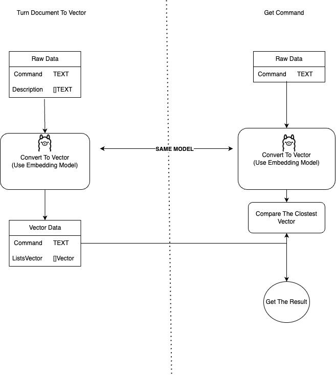

# AGENTIC PROTOTYPE

This repository demonstrates how to create an AI that understands and executes commands as expected, making it an Agentic AI.

## Project Structure

- **api/**: Contains the core API logic.
  - `agi.go`: Main AGI implementation.
  - `texttovector.go`: Converts text to vectors.
  - `vectormapper.go`: Maps vectors.
  - **entities/**: Contains entity definitions.
    - `agi.go`: AGI-related entities.
    - **db/**: Database-related entities.
      - `document.go`: Document entity.
      - `ollama.go`: Ollama entity.
- **file/**: Contains input and output files.
  - `command.json`: Contains all commands and descriptions as raw data, prepared for vector conversion.
  - `output.json`: The result of vector conversion.
- **ollama/**: Contains Ollama-related logic.
  - `embed.go`: Embedding service.
  - `generate_a_completion.go`: Generates completions.
  - `ollama.go`: Main Ollama implementation.
  - `pullmodel.go`: Pulls models.
- **utils/**: Contains utility functions.
  - `utils.go`: General utilities.

## Usage

To convert raw commands from `command.json` into vector documents stored in `output.json`, use the `TurnRawToVectorDocument` function in the `main.go` file:

```go
func TurnRawToVectorDocument(agi *api.AGI) {
    err := agi.TurnRawToVectorDocument()
    if err != nil {
        panic(err)
    }
}
```

After that, have fun creating your own Agentic AI!

Diagram how this works:

